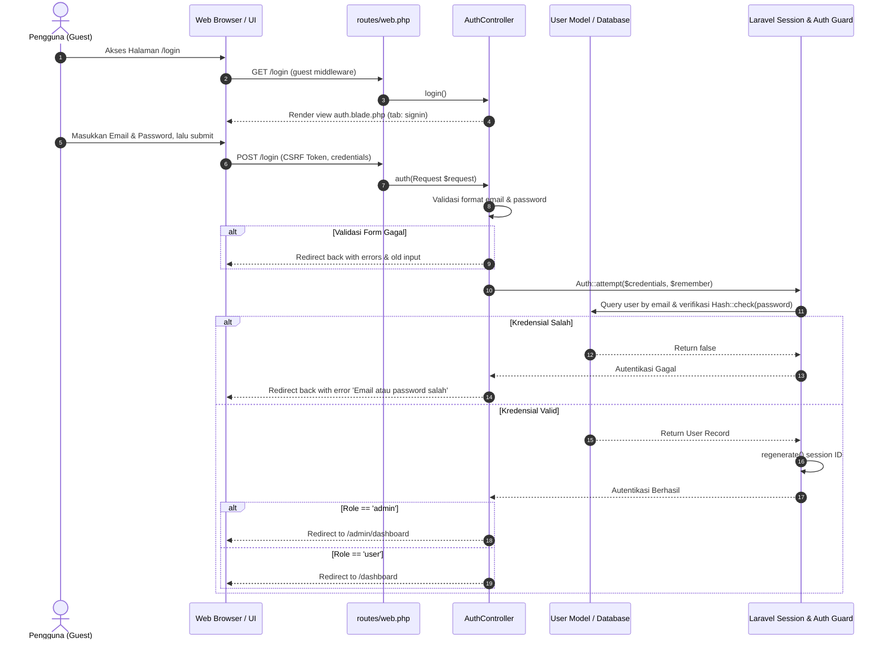
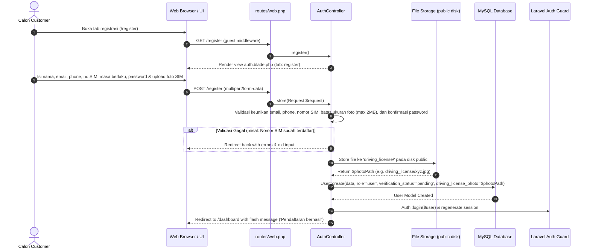
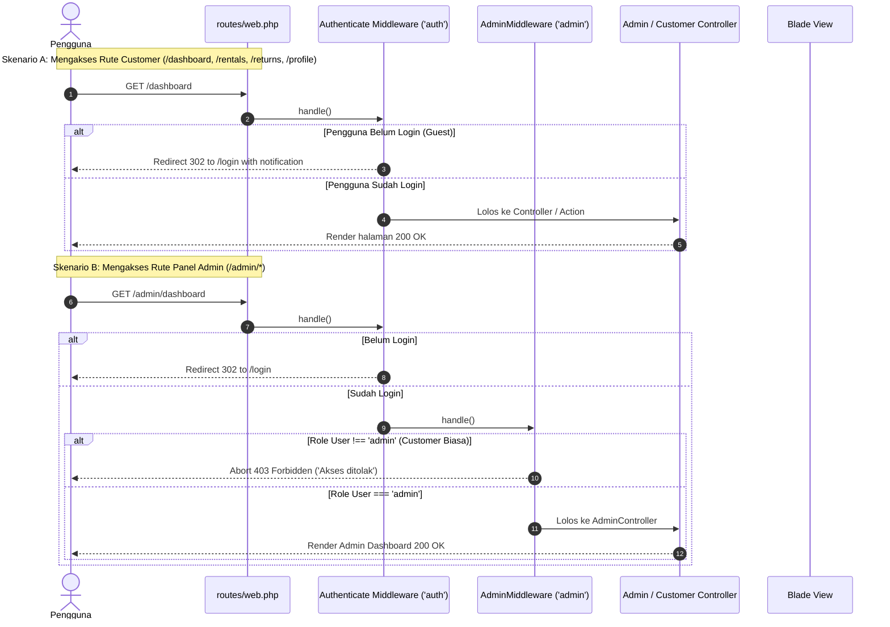
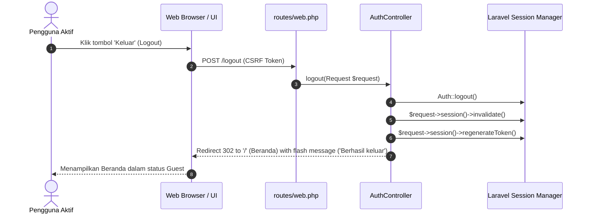

# Sequence Diagram: Authentication & Authorization - Indrasari Rental Car

Dokumen ini memuat diagram urutan (*Sequence Diagram*) visual berbasis Mermaid untuk seluruh alur **Autentikasi, Registrasi dengan Unggah SIM, Otorisasi Middleware Berbasis Peran, dan Logout**.

---

## 1. 🔐 Alur Masuk (Login Flow)

Diagram alur ketika pengguna (Customer atau Admin) melakukan autentikasi login ke sistem.

---

## 2. 📝 Alur Registrasi & Unggah SIM A (Registration Flow)

Diagram alur pendaftaran pengguna baru dengan validasi data identitas dan penyimpanan foto SIM A.

---

## 3. 🛡️ Alur Otorisasi Middleware (Route Protection Flow)

Diagram alur pemeriksaan hak akses saat pengguna mengakses rute Customer atau rute Admin.

---

## 4. 🚪 Alur Keluar (Logout Flow)

Diagram alur pengakhiran sesi pengguna dari sistem.

