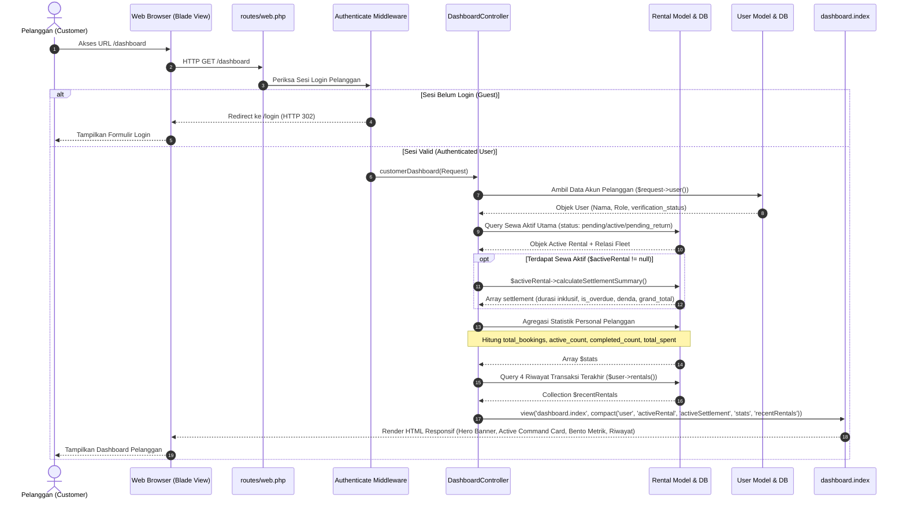
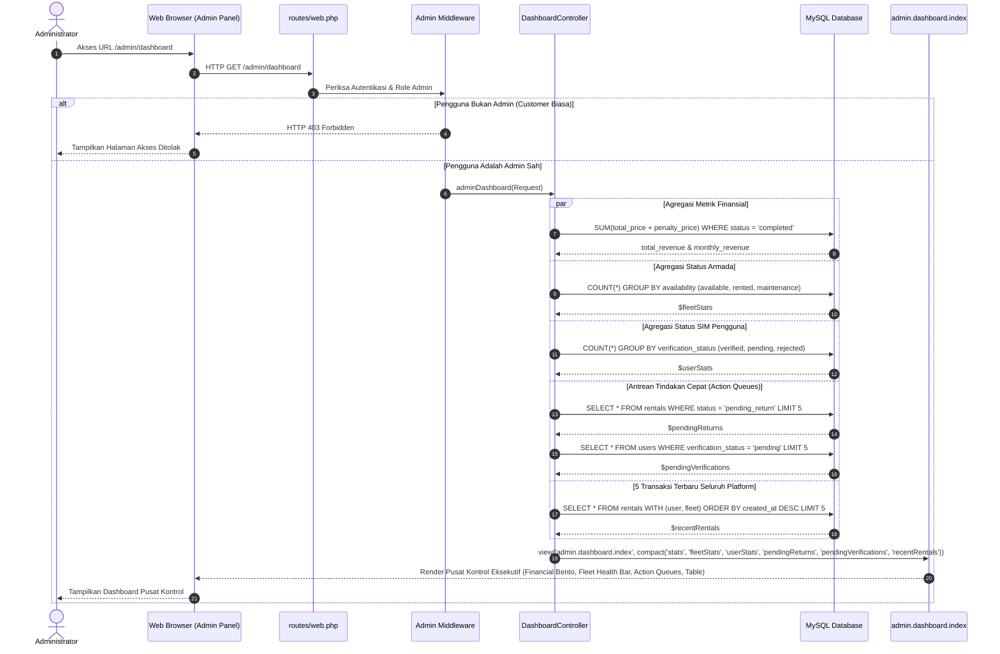
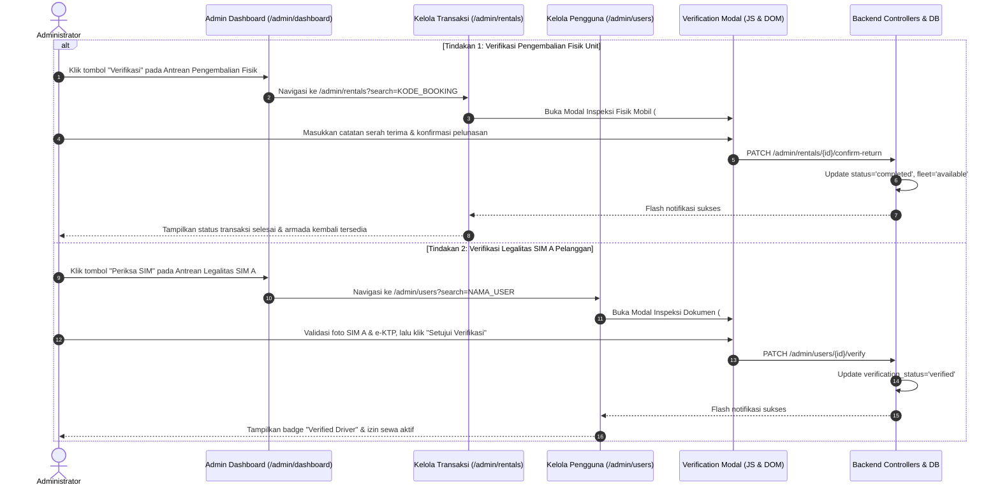

# Sequence Diagram: Executive Dashboards (Customer & Admin)

Dokumen ini memuat diagram alur interaksi (*Sequence Diagrams*) menggunakan sintaks **Mermaid** untuk fitur **Customer & Admin Executive Dashboards** pada aplikasi Indrasari Rental Car.

---

## 1. Customer Dashboard Aggregation & Active Command Flow (`GET /dashboard`)

Diagram berikut mengilustrasikan proses saat pelanggan yang telah login membuka halaman `/dashboard`. Sistem melakukan isolasi query untuk mengambil armada sewa aktif pengguna, menghitung keterlambatan/denda dinamis, merangkum metrik personal, serta menyiapkan riwayat transaksi terbaru.

---

## 2. Admin Operational Central Dashboard Multi-Domain Aggregation Flow (`GET /admin/dashboard`)

Diagram berikut menjelaskan bagaimana Controller mengumpulkan metrik dari berbagai domain (*financial*, *fleets*, *users*, *transactions*, dan *action queues*) untuk disajikan pada Pusat Kontrol Eksekutif Administrator.

---

## 3. Action Required Navigation & Resolution Queue Flow

Diagram berikut memvisualisasikan bagaimana Administrator merespons antrean tindakan cepat langsung dari Dashboard Operasional menuju eksekusi verifikasi.

