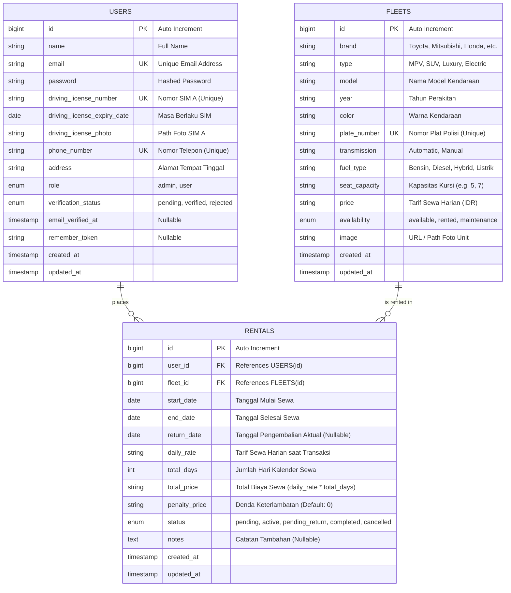

# Entity Relationship Diagram (ERD) - Indrasari Rental Car

Dokumen ini memuat rancangan diagram relasi entitas (*Entity Relationship Diagram*) untuk database aplikasi **Indrasari Rental Car**.

---

## 📊 Diagram ERD (Mermaid)

---

## 📖 Deskripsi Entitas & Relasi

### 1. `users`
Menyimpan data seluruh pengguna sistem, baik **Customer** maupun **Admin**:
- `role`: Membedakan hak akses (`admin` untuk panel administrasi, `user` untuk penyewa).
- `verification_status`: Status verifikasi identitas & SIM oleh Admin (`pending`, `verified`, `rejected`).
- **Relasi**: 1 Pengguna dapat memiliki banyak transaksi sewa (**1-to-Many** dengan `rentals`).

---

### 2. `fleets`
Menyimpan data katalog armada mobil:
- `plate_number`: Nomor plat kendaraan bersifat unik (`UNIQUE`).
- `availability`: Status ketersediaan unit saat ini (`available`, `rented`, `maintenance`).
- **Relasi**: 1 Mobil dapat tercatat dalam banyak riwayat transaksi sewa (**1-to-Many** dengan `rentals`).

---

### 3. `rentals`
Menyimpan data transaksi pemesanan (*booking*) dan pengembalian (*return*):
- `user_id`: Foreign Key ke `users.id` (`onDelete: CASCADE`).
- `fleet_id`: Foreign Key ke `fleets.id` (`onDelete: CASCADE`).
- `status`:
  - `pending`: Menunggu konfirmasi pengambilan unit.
  - `active`: Unit sedang aktif digunakan pelanggan.
  - `pending_return`: Pengajuan pengembalian diajukan oleh customer, menunggu inspeksi admin.
  - `completed`: Pengembalian selesai dan transaksi lunas.
  - `cancelled`: Transaksi dibatalkan.
- **Kalkulasi Biaya**:
  - $\text{Total Biaya Selesai} = \text{total\_price} + \text{penalty\_price}$
