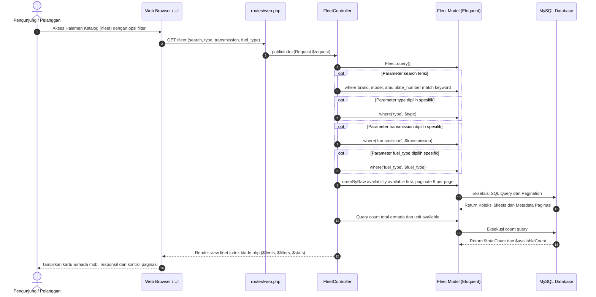
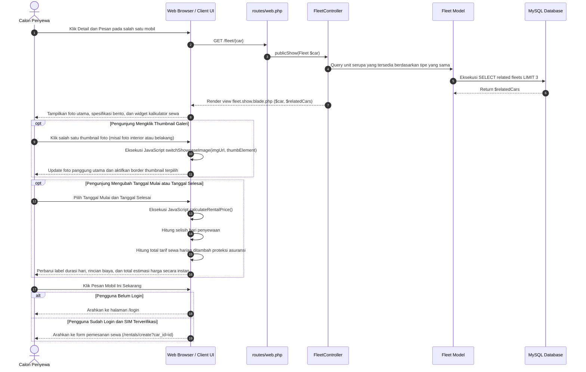
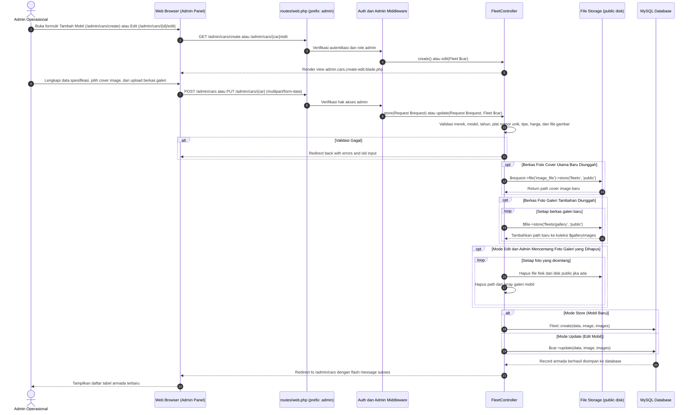
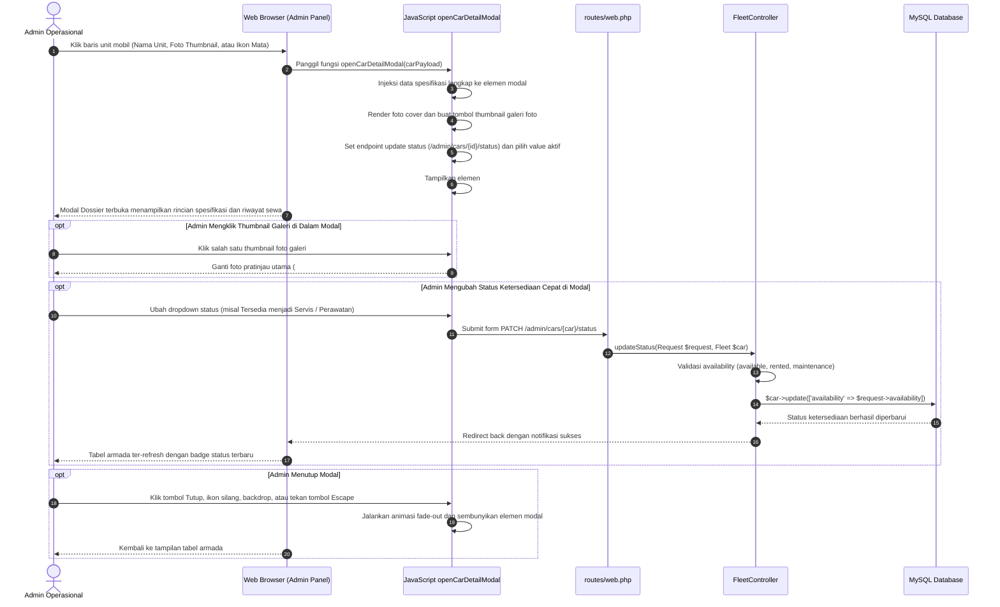

# Sequence Diagram: Fleet Catalog, Car Detail, and Fleet Management - Indrasari Rental Car

Dokumen ini memuat diagram urutan (*Sequence Diagram*) visual berbasis Mermaid untuk seluruh fitur **Katalog Armada Publik, Showcase Detail Mobil & Kalkulator Sewa Real-Time, Manajemen Armada Admin (CRUD & Multi-Galeri), serta Modal Dossier Detail Mobil**.

---

## 1. 🚗 Alur Pencarian & Filter Katalog Armada Publik (Public Catalog Flow)

Diagram interaksi saat pengunjung menelusuri katalog mobil dan menerapkan filter dinamis (kategori, transmisi, bahan bakar, kata kunci pencarian).

---

## 2. 🔍 Alur Showcase Detail Mobil & Kalkulator Sewa Real-Time (Public Car Detail Flow)

Diagram alur ketika calon penyewa membuka halaman detail unit, berinteraksi dengan galeri foto multi-angle, dan menghitung estimasi biaya sewa berdasarkan rentang tanggal.

---

## 3. 🛠️ Alur Manajemen Armada Admin: Tambah/Edit dengan Multi-Galeri (Admin Fleet CRUD Flow)

Diagram alur operasi pembuatan atau pembaruan armada oleh administrator, termasuk unggah berkas foto cover utama, upload berkas multi-foto galeri, dan penghapusan foto galeri lama.

---

## 4. 🗂️ Alur Modal Dossier Detail Mobil & Quick Status Switcher (Admin Detail Modal Flow)

Diagram alur interaksi administrator dalam memeriksa data lengkap armada melalui modal dossier dan mengubah status operasional unit secara instan tanpa memuat ulang form edit.

