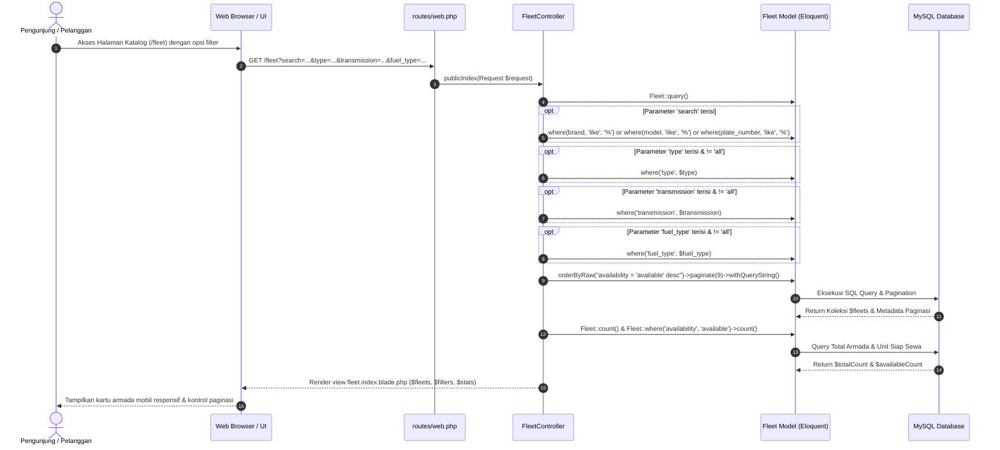
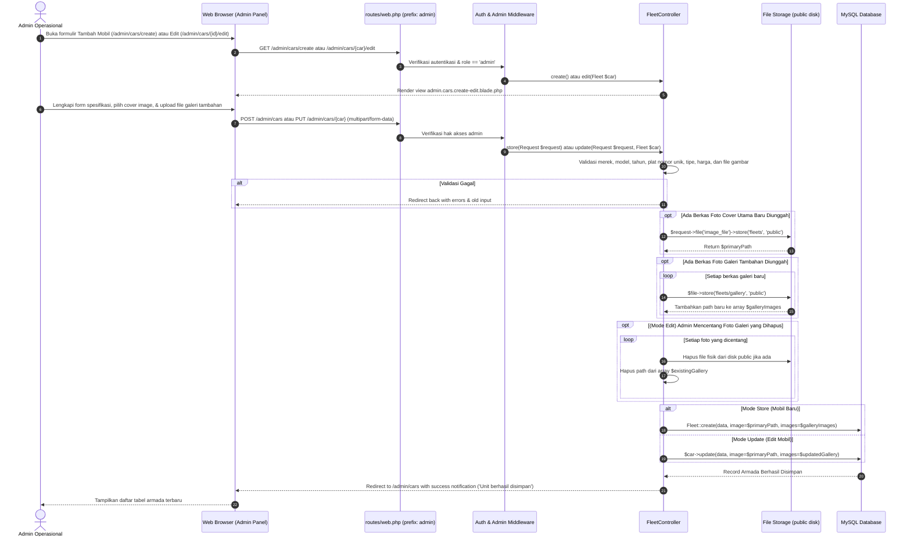
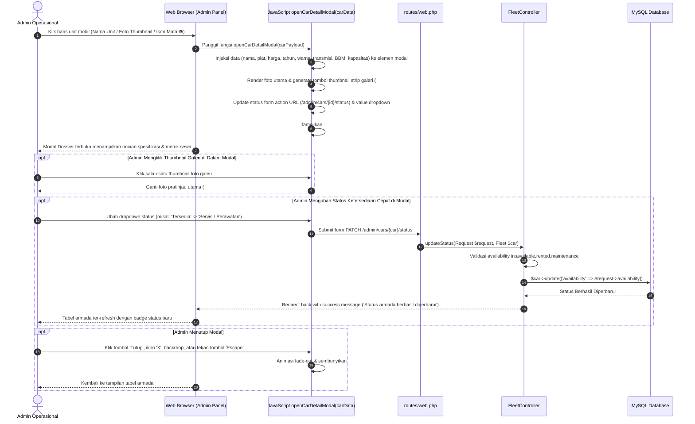

# Sequence Diagram: Fleet Catalog, Car Detail, and Fleet Management - Indrasari Rental Car

Dokumen ini memuat diagram urutan (*Sequence Diagram*) visual berbasis Mermaid untuk seluruh fitur **Katalog Armada Publik, Showcase Detail Mobil & Kalkulator Sewa Real-Time, Manajemen Armada Admin (CRUD & Multi-Galeri), serta Modal Dossier Detail Mobil**.

---

## 1. 🚗 Alur Pencarian & Filter Katalog Armada Publik (Public Catalog Flow)

Diagram interaksi saat pengunjung menelusuri katalog mobil dan menerapkan filter dinamis (kategori, transmisi, bahan bakar, kata kunci pencarian).



---

## 2. 🔍 Alur Showcase Detail Mobil & Kalkulator Sewa Real-Time (Public Car Detail Flow)

Diagram alur ketika calon penyewa membuka halaman detail unit, berinteraksi dengan galeri foto multi-angle, dan menghitung estimasi biaya sewa berdasarkan rentang tanggal.

```mermaid
sequenceDiagram
    autonumber
    actor Customer as Calon Penyewa
    participant Browser as Web Browser / Client UI
    participant Route as routes/web.php
    participant FleetCtrl as FleetController
    participant Model as Fleet Model
    participant DB as MySQL Database

    Customer->>Browser: Klik "Detail & Pesan →" pada salah satu mobil
    Browser->>Route: GET /fleet/{car}
    Route->>FleetCtrl: publicShow(Fleet $car)
    
    FleetCtrl->>Model: Fleet::where('availability', 'available')->where('id', '!=', $car->id)->where('type', $car->type)->take(3)->get()
    Model->>DB: Query armada serupa yang tersedia
    DB-->>Model: Return $relatedCars
    
    FleetCtrl-->>Browser: Render view fleet.show.blade.php ($car, $relatedCars)
    Browser-->>Customer: Tampilkan foto utama, spesifikasi bento, & widget kalkulator sewa

    opt Pengunjung Mengklik Thumbnail Galeri
        Customer->>Browser: Klik salah satu thumbnail foto (misal: interior / belakang)
        Browser->>Browser: JavaScript switchShowcaseImage(imgUrl, thumbElement)
        Browser-->>Customer: Update hero image stage & beri border aktif pada thumbnail terpilih
    end

    opt Pengunjung Mengubah Tanggal Mulai / Tanggal Selesai
        Customer->>Browser: Pilih Tanggal Mulai (Start Date) & Tanggal Selesai (End Date)
        Browser->>Browser: JavaScript calculateRentalPrice()
        Browser->>Browser: Hitung selisih hari = Math.ceil((end - start) / (1000 * 60 * 60 * 24))
        Browser->>Browser: Subtotal = durasiHari * tarifHarian; Total = Subtotal + biayaAsuransi
        Browser-->>Customer: Perbarui label durasi hari, rincian biaya, dan total estimasi harga secara real-time
    end

    Customer->>Browser: Klik "Pesan Mobil Ini Sekarang"
    alt User Belum Login
        Browser-->>Customer: Arahkan ke /login dengan parameter redirect
    else User Sudah Login & SIM Terverifikasi
        Browser-->>Customer: Arahkan ke alur checkout sewa (/rentals/create?car_id=...)
    end
```

---

## 3. 🛠️ Alur Manajemen Armada Admin: Tambah/Edit dengan Multi-Galeri (Admin Fleet CRUD Flow)

Diagram alur operasi pembuatan atau pembaruan armada oleh administrator, termasuk unggah berkas foto cover utama, upload berkas multi-foto galeri, dan penghapusan foto galeri lama.



---

## 4. 🗂️ Alur Modal Dossier Detail Mobil & Quick Status Switcher (Admin Detail Modal Flow)

Diagram alur interaksi administrator dalam memeriksa data lengkap armada melalui modal dossier dan mengubah status operasional unit secara instan tanpa memuat ulang form edit.


