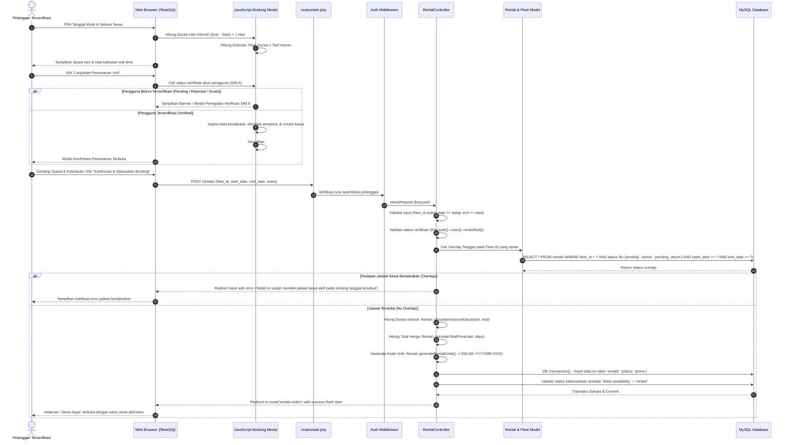
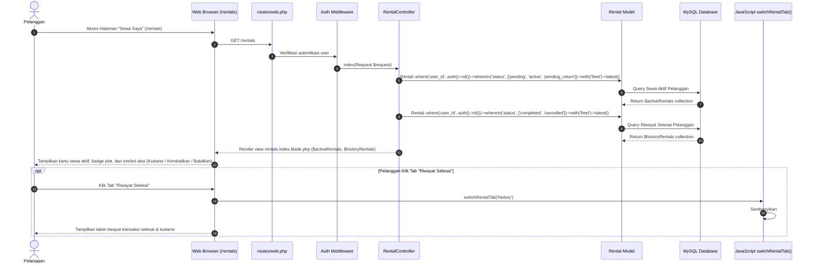
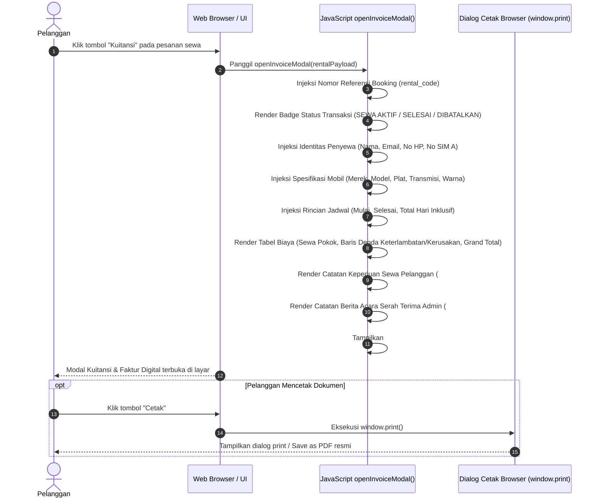
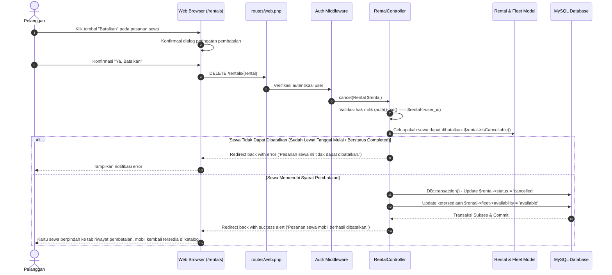

# Sequence Diagram: Customer Rental Booking & "Sewa Saya" Portal - Indrasari Rental Car

Dokumen ini memuat diagram urutan (*Sequence Diagram*) visual berbasis Mermaid untuk alur **Pemesanan Mobil (Rental Booking), Validasi Rentang Tanggal Bertabrakan (Date Overlap Validation), Gating SIM A Terverifikasi, Portal "Sewa Saya", Modal Kuitansi & Faktur Digital, serta Pembatalan Pesanan**.

---

## 1. 🚗 Alur Pemesanan Mobil & Kalkulasi Biaya Inklusif (Rental Booking Flow)

Diagram alur saat pelanggan terverifikasi memilih tanggal sewa pada halaman detail kendaraan, memeriksa rincian biaya pada modal konfirmasi, dan menyelesaikan booking ke dalam sistem.

---

## 2. 📋 Alur Portal "Sewa Saya" & Pergantian Tab (My Rentals & Tab Switching Flow)

Diagram alur saat pelanggan membuka portal sewa saya untuk memantau kendaraan yang sedang aktif disewa, melihat alert keterlambatan jika melewati batas waktu, dan melihat riwayat sewa yang telah selesai.

---

## 3. 🧾 Alur Modal Kuitansi & Faktur Digital Resmi (Digital Invoice Receipt Flow)

Diagram alur saat pelanggan mengklik tombol "Kuitansi" pada kartu sewa aktif maupun baris riwayat selesai untuk melihat dokumen tagihan resmi ber-kop RSUD Indrasari dan mencetaknya ke format PDF / fisik.

---

## 4. ❌ Alur Pembatalan Pesanan Sewa (Rental Cancellation Flow)

Diagram alur saat pelanggan membatalkan pesanan sewa yang belum dimulai, mengembalikan status mobil menjadi tersedia untuk publik secara instan.

