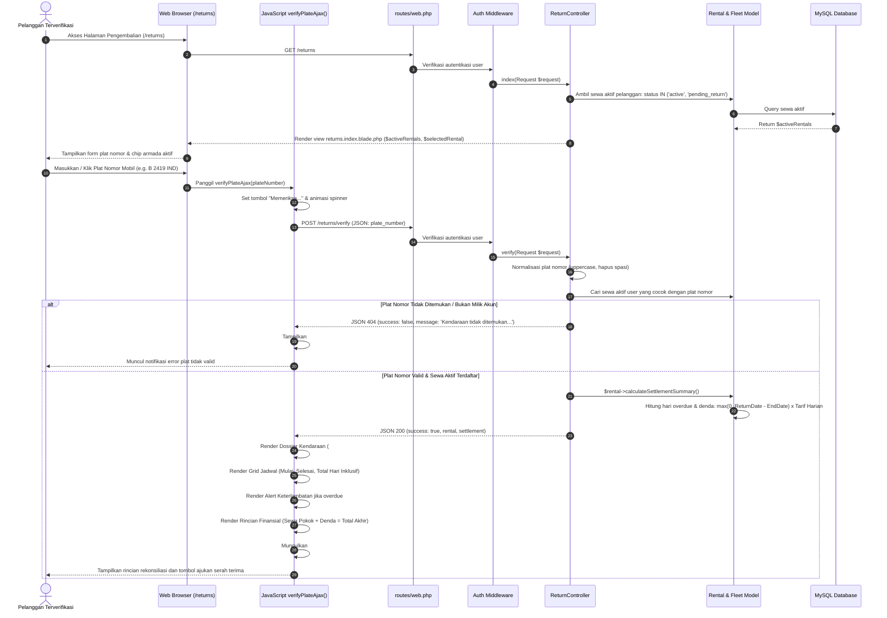
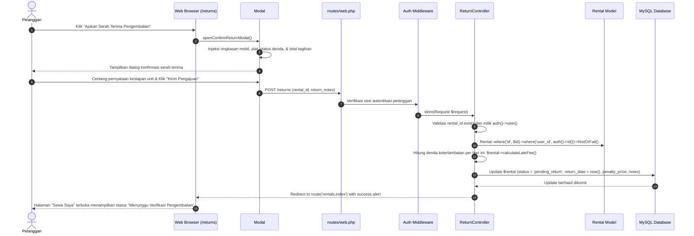
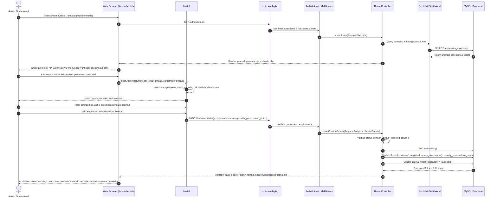

# Sequence Diagram: Car Returns & Late Fee Processing - Indrasari Rental Car

Dokumen ini memuat diagram urutan (*Sequence Diagram*) visual berbasis Mermaid untuk alur **Pengembalian Mobil Pelanggan (Customer Car Returns), Verifikasi Nomor Plat Instan, Mesin Perhitungan Denda Keterlambatan (Late Fee Engine), Portal Manajemen Peminjaman Admin, Inspeksi Fisik Serah Terima Unit, dan Faktur Pelunasan Akhir**.

---

## 1. 🔍 Alur Verifikasi Nomor Plat & Rekonsiliasi Tagihan Pelanggan (Plate Verification Flow)

Diagram alur saat pelanggan memasukkan nomor plat polisi pada halaman `/returns` atau memilih dari *quick-chips* armada aktif untuk memverifikasi kepemilikan sewa, memeriksa tanggal tenggat, dan melihat estimasi denda keterlambatan secara transparan.



---

## 2. 📝 Alur Pengajuan Serah Terima Pengembalian Mobil (Customer Return Submission Flow)

Diagram alur saat pelanggan menyetujui ringkasan biaya akhir dan mengajukan serah terima unit mobil kepada petugas operasional RSUD Indrasari.



---

## 3. 🔍 Alur Verifikasi Fisik & Persetujuan Pengembalian Admin (Admin Return Inspection Flow)

Diagram alur saat staf operasional / admin memeriksa unit kendaraan fisik yang diserahkan, mengonfirmasi pelunasan sewa beserta denda, menyelesaikan transaksi (`completed`), dan merilis mobil kembali berstatus `available`.



---

## 4. 🧾 Alur Kuitansi & Faktur Pelunasan Resmi (Settlement Invoice Flow)

Diagram alur saat admin atau pelanggan mencetak kuitansi resmi setelah transaksi dinyatakan selesai (`completed`), lengkap dengan rincian biaya pokok, denda keterlambatan/kerusakan, catatan keperluan sewa pelanggan, dan berita acara serah terima admin.

```mermaid
sequenceDiagram
    autonumber
    actor Actor as Pelanggan / Admin
    participant Browser as Web Browser (Invoice Modal)
    participant DOM as JavaScript openInvoiceModal()
    participant Print as Browser Print Dialog (window.print)

    Actor->>Browser: Klik tombol "Lihat Kuitansi" pada transaksi selesai
    Browser->>DOM: Panggil openInvoiceModal(rentalPayload)
    DOM->>DOM: Injeksi Kop Surat Resmi RSUD Indrasari
    DOM->>DOM: Injeksi Kode Booking, Identitas Penyewa, Spek Kendaraan, & Plat
    DOM->>DOM: Render Rincian: Sewa Pokok + Denda Keterlambatan = Total Akhir
    DOM->>DOM: Render Keperluan Sewa Pelanggan (#invoiceCustomerNotesContainer) jika ada
    DOM->>DOM: Render Berita Acara Serah Terima Admin (#invoiceAdminNotesContainer) jika ada
    DOM-->>Actor: Modal Kuitansi Resmi Terbuka

    opt Cetak Dokumen
        Actor->>Browser: Klik "Cetak Faktur"
        Browser->>Print: Eksekusi window.print()
        Print-->>Actor: Dialog cetak printer / Save as PDF terbuka
    end
```
