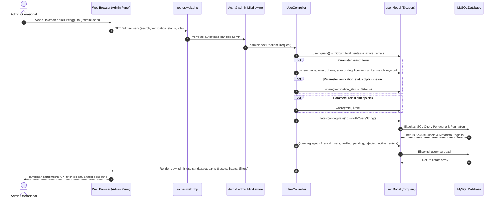
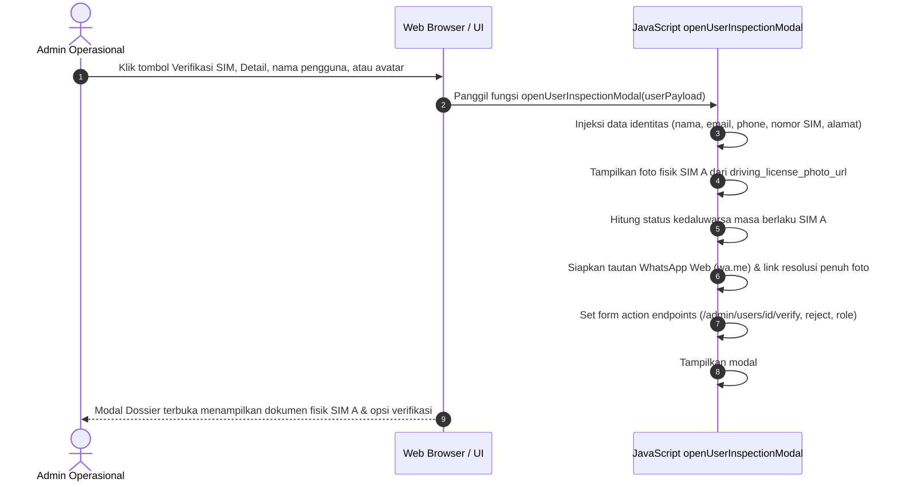
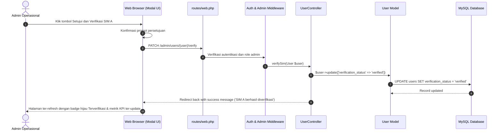
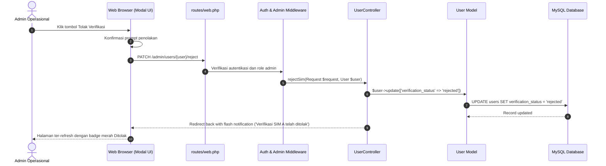

# Sequence Diagram: Admin User Management & SIM A Verification - Indrasari Rental Car

Dokumen ini memuat diagram urutan (*Sequence Diagram*) visual berbasis Mermaid untuk seluruh alur **Manajemen Pengguna Admin, Filter Status Verifikasi, Inspeksi Dokumen Fisik SIM A, Persetujuan/Penolakan Verifikasi, dan Pengubahan Peran Akun**.

---

## 1. 👥 Alur Daftar Pengguna & Filter Status SIM A (Admin User Listing Flow)

Diagram alur saat administrator membuka panel kelola pengguna, melihat metrik KPI agregat, dan memfilter data berdasarkan kata kunci pencarian, status verifikasi, atau peran akun.

---

## 2. 🔍 Alur Modal Inspeksi Dokumen SIM A (SIM A Inspection Modal Flow)

Diagram alur saat admin mengklik baris pengguna untuk memeriksa keabsahan foto fisik dokumen SIM A, masa berlaku, kontak WhatsApp, dan alamat domisili.

---

## 3. ✅ Alur Persetujuan & Verifikasi SIM A (SIM Verification Approval Flow)

Diagram alur saat admin menyetujui dokumen SIM A sehingga pelanggan mendapatkan izin legalitas untuk menyewa kendaraan.

---

## 4. ❌ Alur Penolakan Verifikasi SIM A (SIM Verification Rejection Flow)

Diagram alur saat admin menolak dokumen SIM A yang tidak valid, buram, atau telah kedaluwarsa.

