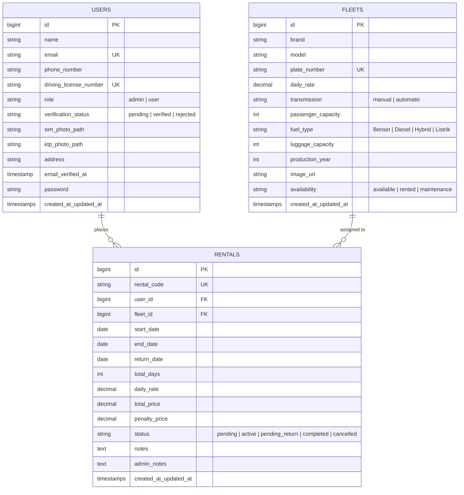

# Spesifikasi Fitur & Dokumentasi Arsitektur Sistem Persewaan Mobil
**RSUD Indrasari Rental Car Platform**

---

## 📌 1. Ringkasan Eksekutif & Arsitektur Sistem

Aplikasi **Indrasari Rental Car** adalah platform web manajemen persewaan mobil komprehensif berbasis **Laravel 12 (PHP 8.5)**, **Tailwind CSS v4**, **Blade Templating**, dan **MySQL**. Sistem ini dirancang untuk melayani dua jenis peran pengguna (*User Roles*): **Pelanggan (*Customer*)** dan **Administrator Operasional (*Admin*)**, serta menyediakan portal publik bagi calon penyewa.

### 🛠️ Technology Stack & Standards:
- **Framework**: Laravel 12.x / PHP 8.5
- **Frontend & Styling**: Blade Templating, Tailwind CSS v4, Google Material Symbols, Google Fonts (*Instrument Sans* & *Plus Jakarta Sans*)
- **Theme Support**: Dual-Theme Reaktif (**Light Mode & Dark Mode**) tersinkronisasi via localStorage & `class="dark"`
- **Testing Engine**: **Pest PHP 3.x** (89 Feature Tests, 395 Assertions, 100% Pass)
- **Code Linter**: **Laravel Pint** (Clean / Strict Agent Formatting)

---

## 🏛️ 2. Arsitektur Database & Relasi Model

Sistem didukung oleh 3 tabel inti dengan integritas referensial dan pengindeksan optimal:



---

## 🧮 3. Formula Logika Bisnis & Perhitungan Finansial

Aplikasi mengimplementasikan formula perhitungan terstandarisasi untuk menjamin keadilan transaksi:

### A. Durasi Sewa Hari Kalender Inklusif (*Inclusive Days Formula*)
Perhitungan durasi memperhitungkan hari pertama dan hari terakhir pengambilan/pengembalian unit secara penuh:
$$\text{Durasi Hari} = (\text{Tanggal Selesai} - \text{Tanggal Mulai}) + 1 \text{ Hari}$$

### B. Kalkulasi Denda Keterlambatan Dinamis (*Late Fee Engine*)
Denda dihitung per hari keterlambatan jika tanggal pengembalian fisik melampaui tanggal jatuh tempo:
$$\text{Hari Terlambat} = \max(0, \, \text{Tanggal Kembali Aktual} - \text{Tanggal Selesai Disepakati})$$
$$\text{Denda Keterlambatan} = \text{Hari Terlambat} \times \text{Tarif Harian Unit Mobil}$$

### C. Rekonsiliasi Tagihan Akhir Pelunasan (*Grand Settlement*)
$$\text{Total Pelunasan} = (\text{Tarif Harian} \times \text{Durasi Hari}) + \text{Denda Keterlambatan}$$

---

## 🚀 4. Rincian Modul & Implementasi Fitur

### 🔵 A. Modul Publik (Guest / Pengunjung)

| Fitur | Rute & Controller | Status | Deskripsi & Aturan Bisnis |
|---|---|:---:|---|
| **Landing Page** | `GET /`<br>`HomeController` | ✅ Selesai | Hero banner interaktif, widget pencarian tanggal sewa & jenis armada, showcase mobil unggulan (*featured fleet*), bento keunggulan layanan (*clean, transparent, 24/7 support*). |
| **Katalog Armada** | `GET /fleet`<br>`FleetController@publicIndex` | ✅ Selesai | Menampilkan seluruh unit mobil dengan filter dinamis: pencarian teks (*brand/model*), filter transmisi (Manual/Matic), filter ketersediaan (*Available*), dan sorting harga. |
| **Detail Mobil** | `GET /fleet/{car}`<br>`FleetController@publicShow` | ✅ Selesai | Galeri foto, badge ketersediaan (*Tersedia / Sedang Disewa / Bengkel*), spesifikasi teknis lengkap (bahan bakar, kursi, bagasi, tahun), kalkulator estimasi tarif interaktif, dan tombol *Booking CTA*. |
| **Login Pengguna** | `GET /login`<br>`POST /login`<br>`AuthController@auth` | ✅ Selesai | Autentikasi aman berbasis Email dan Password dengan *remember-me* token dan redirect otomatis sesuai peran (*Admin* $\rightarrow$ `/admin/dashboard`, *Customer* $\rightarrow$ `/dashboard`). |
| **Registrasi Pengguna** | `GET /register`<br>`POST /register`<br>`AuthController@store` | ✅ Selesai | Pendaftaran akun baru dengan data pribadi: Nama Lengkap, Alamat, Nomor Telepon, Nomor SIM A (unik), Email (unik), Password, dan upload dokumen SIM. Status awal akun: `pending` verifikasi. |

---

### 🟢 B. Modul Pelanggan (Customer Protected)

| Fitur | Rute & Controller | Status | Deskripsi & Aturan Bisnis |
|---|---|:---:|---|
| **Executive Customer Dashboard** | `GET /dashboard`<br>`DashboardController@customerDashboard` | ✅ Selesai | **Pusat Komando Pelanggan**: Welcome hero dengan inisial avatar & badge verifikasi SIM A, **Active Booking Command Card** (foto unit, plat nomor, sisa hari, alert keterlambatan dinamis + tombol cepat *Kembalikan Mobil*), bento metrik personal (*Total Peminjaman, Mobil Aktif, Selesai, Total Pengeluaran*), dan tabel 4 transaksi terakhir. |
| **Profil & Upload Dokumen** | `GET /profile`<br>`PUT /profile`<br>`PUT /profile/password`<br>`UserController` | ✅ Selesai | Menampilkan profil lengkap, edit biodata & kontak, upload/perbarui foto fisik SIM A dan e-KTP ke storage, serta form ubah password aman dengan konfirmasi. |
| **Pemesanan Sewa Mobil** | `POST /rentals`<br>`RentalController@store` | ✅ Selesai | Validasi ketat: (1) Pelanggan wajib berstatus **`verified`** (SIM A disetujui admin), (2) Pengecekan anti-tabrakan jadwal sewa (*date collision check*) pada rentang tanggal yang diminta, (3) Penetapan status awal `active`, (4) Pembuatan kode booking unik format `IND-BK-YYYYMM-XXXX`. |
| **Portal "Sewa Saya"** | `GET /rentals`<br>`RentalController@index` | ✅ Selesai | Menampilkan tab transaksi **Sedang Disewa (Aktif)** dan **Riwayat Selesai & Dibatalkan**, rincian biaya sewa, durasi inklusif, modal kuitansi digital resmi RSUD Indrasari, dan tombol pembatalan pesanan sebelum masa sewa berjalan. |
| **Pengembalian Mobil Pelanggan** | `GET /returns`<br>`POST /returns/verify`<br>`POST /returns`<br>`ReturnController` | ✅ Selesai | **Sistem Pengembalian Mandiri**: Form input plat nomor dengan format kapital otomatis (*auto-uppercase*) & *quick chips* armada aktif pengguna, endpoint live AJAX verification untuk pencocokan kepemilikan sewa, rincian biaya transparan + denda otomatis, dan submit pengajuan status `pending_return`. |
| **Keluar Sesi (Logout)** | `POST /logout`<br>`AuthController@logout` | ✅ Selesai | Menghapus sesi aktif secara aman, invalidasi cookie sesi, dan regenerasi token CSRF. |

---

### 🟣 C. Modul Administrator (Admin Protected)

| Fitur | Rute & Controller | Status | Deskripsi & Aturan Bisnis |
|---|---|:---:|---|
| **Executive Operational Central Dashboard** | `GET /admin`<br>`GET /admin/dashboard`<br>`DashboardController@adminDashboard` | ✅ Selesai | **Pusat Intelijen Operasional**: Banner kontrol real-time dengan 3 tombol pintasan cepat berindikator antrean, bento KPI finansial (*Total Pendapatan Selesai + Pendapatan Bulan Berjalan*), **Fleet Status Composition Bar** (progress bar proporsional: *Tersedia / Disewa / Bengkel*), **Action Required Queues** (antrean pengembalian fisik unit & antrean validasi SIM A), dan tabel 5 transaksi terbaru. |
| **Manajemen Armada Mobil** | `GET /admin/cars`<br>`GET /admin/cars/create`<br>`POST /admin/cars`<br>`GET /admin/cars/{car}/edit`<br>`PUT /admin/cars/{car}`<br>`DELETE /admin/cars/{car}`<br>`PATCH /admin/cars/{car}/status`<br>`FleetController` | ✅ Selesai | CRUD lengkap armada mobil: tambah unit baru dengan upload foto, edit data spesifikasi, hapus mobil (dengan proteksi integritas jika memiliki riwayat sewa aktif), dan quick switch status operasional (`available`, `rented`, `maintenance`). |
| **Manajemen Pengguna & Verifikasi SIM A** | `GET /admin/users`<br>`PATCH /admin/users/{user}/verify`<br>`PATCH /admin/users/{user}/reject`<br>`PATCH /admin/users/{user}/role`<br>`UserController` | ✅ Selesai | Daftar seluruh pengguna dengan filter status verifikasi, modal inspeksi dokumen SIM A & e-KTP resolusi tinggi, tombol aksi **Verifikasi SIM** (memberikan izin sewa) atau **Tolak Verifikasi** (disertai catatan perbaikan), dan promosi peran (*User $\leftrightarrow$ Admin*). |
| **Manajemen Transaksi & Pengembalian Unit** | `GET /admin/rentals`<br>`PATCH /admin/rentals/{rental}/confirm-return`<br>`RentalController` | ✅ Selesai | Monitoring seluruh transaksi peminjaman di platform, filter multi-status (`active`, `pending_return`, `completed`, `cancelled`), modal inspeksi serah terima fisik unit mobil (`#returnVerifyModal`), penyesuaian denda/catatan admin, dan tombol **Konfirmasi Pengembalian Selesai** (mengubah transaksi ke `completed` dan mengembalikan mobil ke status `available`). |

---

## 📊 5. Indeks Dokumentasi Visual & Sequence Diagrams

Seluruh alur interaksi sistem terdokumentasi dalam diagram urutan visual berbasis Mermaid di direktori `docs/diagrams/`:

1. **[`docs/diagrams/erd.md`](erd.md)**: Diagram Relasi Entitas (*Entity Relationship Diagram*) database dan relasi antar tabel.
2. **[`docs/diagrams/auth-sequence.md`](auth-sequence.md)**: Alur registrasi pengguna baru, upload dokumen SIM, login sesi, dan logout.
3. **[`docs/diagrams/fleet-sequence.md`](fleet-sequence.md)**: Alur katalog publik, filter ketersediaan armada, dan CRUD mobil admin.
4. **[`docs/diagrams/user-management-sequence.md`](user-management-sequence.md)**: Alur peninjauan dokumen SIM A oleh admin, verifikasi driver, dan penolakan berkas.
5. **[`docs/diagrams/rental-booking-sequence.md`](rental-booking-sequence.md)**: Alur pemesanan mobil, pengecekan anti-tabrakan jadwal, tab portal sewa, dan kuitansi digital.
6. **[`docs/diagrams/returns-sequence.md`](returns-sequence.md)**: Alur verifikasi plat nomor, kalkulasi denda keterlambatan, pengajuan pengembalian, dan konfirmasi serah terima fisik admin.
7. **[`docs/diagrams/dashboard-sequence.md`](dashboard-sequence.md)**: Alur agregasi multi-domain dashboard pelanggan dan dashboard operasional admin.

---

## 🏆 6. Indeks Pull Request & Riwayat Rilis

| No | Branch Fitur | Pull Request | Cakupan Unit | Status Rilis |
|:---:|---|---|---|:---:|
| 1 | `feat/database-and-models` | **[PR #1](https://github.com/MF-Rozi/indrasari-rental-car-task/pull/1)** | Database Migrations, Models, Factories, Seeders, ERD | Merged / Green ✅ |
| 2 | `feat/auth-and-profile` | **[PR #2](https://github.com/MF-Rozi/indrasari-rental-car-task/pull/2)** | Login, Register, SIM Upload, Profile, Middleware | Merged / Green ✅ |
| 3 | `feat/fleet-catalog-and-management` | **[PR #3](https://github.com/MF-Rozi/indrasari-rental-car-task/pull/3)** | Landing Page, Public Catalog, Admin Fleet CRUD | Merged / Green ✅ |
| 4 | `feat/admin-user-management` | **[PR #4](https://github.com/MF-Rozi/indrasari-rental-car-task/pull/4)** | Admin User Table, SIM A Modal, Verify & Reject Flow | Merged / Green ✅ |
| 5 | `feat/rental-booking-and-my-rentals` | **[PR #5](https://github.com/MF-Rozi/indrasari-rental-car-task/pull/5)** | Booking Engine, Overlap Guard, My Rentals Portal, Invoice | Merged / Green ✅ |
| 6 | `feat/car-returns-and-late-fee` | **[PR #6](https://github.com/MF-Rozi/indrasari-rental-car-task/pull/6)** | Return Portal, Instant Plate Lookup, Late Fee Engine, Admin Verification | Merged / Green ✅ |
| 7 | `feat/customer-and-admin-dashboards` | **[PR #7](https://github.com/MF-Rozi/indrasari-rental-car-task/pull/7)** | Customer & Admin Dashboards, Real-Time Aggregators, Operational Queues | Open / Green ✅ |

---

## 🧪 7. Metrik Jaminan Kualitas (*Quality Assurance*)

- **Pest Test Suite**: **89 tests passing (395 assertions)**
  ```bash
  vendor/bin/pest
     PASS  Tests\Feature\AuthAndFleetScreensTest
     PASS  Tests\Feature\AuthenticationTest
     PASS  Tests\Feature\CarReturnTest
     PASS  Tests\Feature\DashboardTest
     PASS  Tests\Feature\DatabaseSeederTest
     PASS  Tests\Feature\FleetManagementTest
     PASS  Tests\Feature\RentalBookingTest
     PASS  Tests\Feature\UserManagementTest
  
  Tests:    89 passed (395 assertions)
  Duration: 3.11s
  ```
- **Code Linter**: **Laravel Pint**
  ```bash
  vendor/bin/pint --format agent
  {"tool":"pint","result":"passed"}
  ```
- **Asset Compilation**: **Vite & Tailwind CSS v4**
  ```bash
  npm run build
  built in 772ms (Clean build)
  ```
